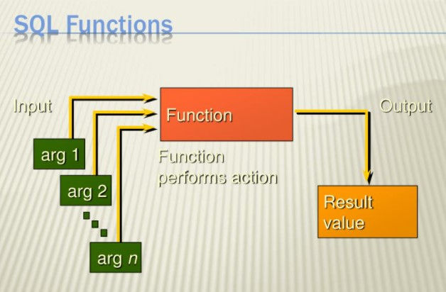
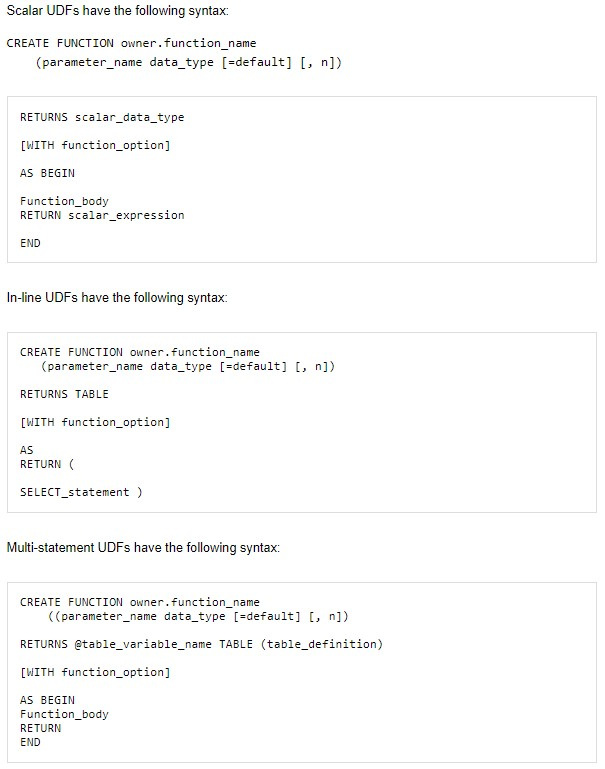

# Assignment 07 - Functions

## IT FDN 130 A Wi 21: Foundations of Databases & SQL Programming

### INTRODUCTION

The seventh module of this course discussed SQL Functions in greater depth.  A function is a predefined formula which takes one or more arguments as input, processes the arguments, and then returns an output (Source: [SQL functions and references - w3resource)](url).  This page will discuss when to use a user defined function and the differences between Scalar, Inline, and Multi-Statement Functions.

### WHEN TO USE A SQL USER DEFINED FUNCTION (UDF)

A user defined function can simplify the code base by encapsulating complex logic into a saved formula and allowing reuse of that code elsewhere.  A function can be used to return a scalar value or to return an entire table derived from a single or a series of inputs. Normally a View is probably a better choice than a table valued UDF, but a table valued function can be useful for JOIN operations when data needs to be pulled from different tables, and a calculation needs to be accomplished and an aggregation is returned.

### DIFFERENCES BETWEEN SCALAR, IN-LINE, AND MULTI-STATEMENT FUNCTIONS

The three types of functions in SQL are scalar, in-line, and multi-statement.  
Their differences are discussed below:

- Scalar – The scalar function can accept one or more inputs and is used to calculate and return a single scalar value.  The function can return any data type except for text, ntext, image, cursor, and timestamp.  A scalar function can accept logic code such as IF blocks and WHILE loops but cannot update the underlying data table.  A scalar function can also call another function.

- In-line – The in-line function is a table valued function and returns a table as the output.  The in-line function contains a single SELECT statement that dictates the structure of the return table.  Because this function is treated similarly to a View by SQL, this function is better for performance compared to a multi-statement function.  Finally, an in-line function can be used to update the underlying database table.

- Multi-statement – The multi-statement function allows the structure of the return table to be defined.  This function contains BEGIN and END blocks in the syntax and is treated similarly to a stored procedure by SQL (causing slower performance). This function cannot be used to update the underlying database table.

The basic syntax for user defined functions are shown in Figure 1 below:

_Figure 1. Basic Syntax of Scalar, In-Line Table, and Multi-Statement Table Functions 
(Source: [UDF Syntax | SQL Server User-Defined Functions (UDFs) | InformIT](url) 
(Links to External Site)_

### CONCLUSION

This page discussed when to use a user defined function (UDF) and the differences between Scalar, In-Line, and Multi-Statement functions.  Functions can be very useful to capture and reuse common business logic but may or may not be a better choice to replace a View or a Stored Procedure.  Of the three types of functions, the scalar function appears to provide the most useful functionality, but the functionality required for a given operation will best determine if a function is the best choice for the application.   

***************************************************************************************************************************************************
_ARFAZI is new to Github and using the site for SQL and Python classes.
She lives in Seattle and hopes at least one graduate school admits her
so she can become a Data Scientist one day._

